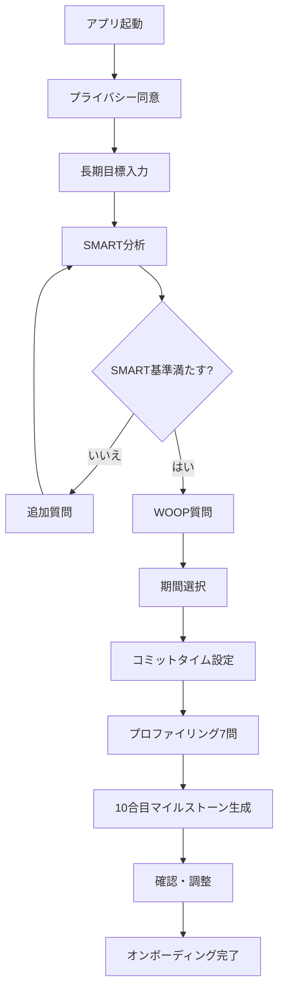
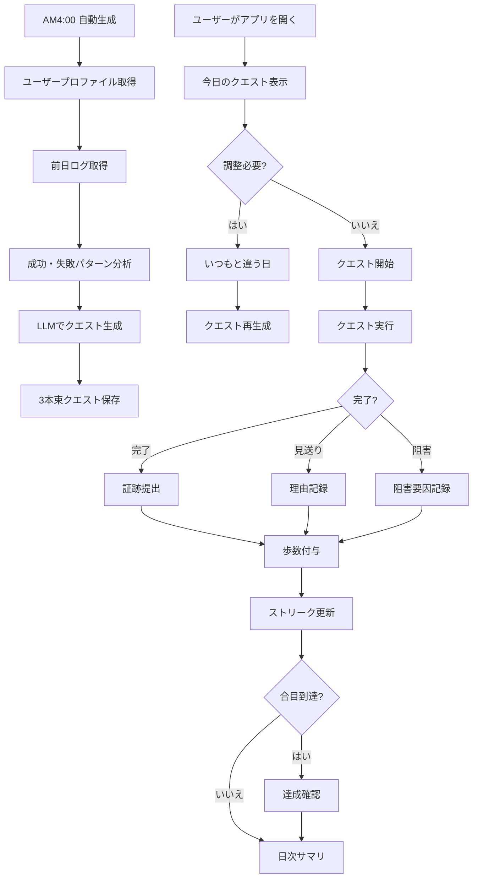
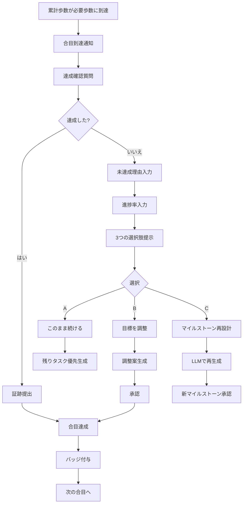
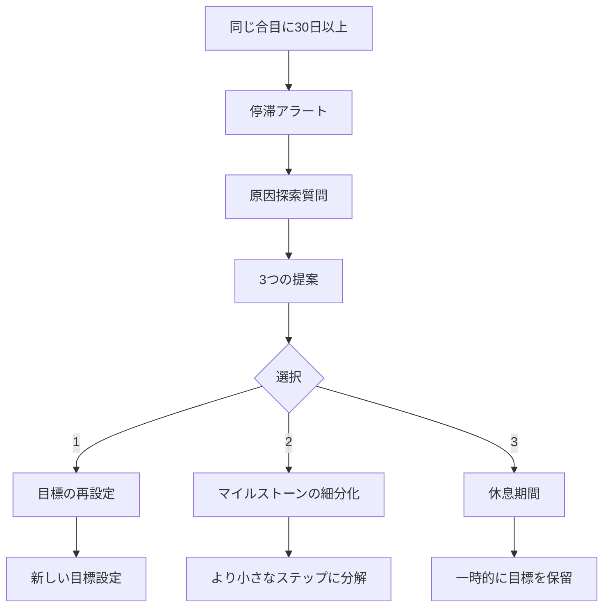

# climb-you システム全体概要

## 目次

1. [プロダクト概要](#プロダクト概要)
2. [システムアーキテクチャ](#システムアーキテクチャ)
3. [全体ワークフロー](#全体ワークフロー)
4. [主要機能](#主要機能)
5. [データモデル](#データモデル)
6. [技術スタック](#技術スタック)
7. [セキュリティ](#セキュリティ)
8. [デプロイメント](#デプロイメント)

---

## プロダクト概要

### コンセプト
climb-youは、長期目標を「山登り」に見立て、日々のクエストをこなしながら10合目（目標達成）を目指す目標達成支援アプリです。

### 主要な特徴
- 🏔️ **10合目システム** - 長期目標を10段階のマイルストーンに分解
- 🚶 **歩数システム** - クエスト完了で歩数を獲得し、山を登る
- 🤖 **自動クエスト生成** - 毎日AM4:00に最適なクエストを自動生成
- 📊 **学習機能** - 過去の成功・失敗パターンから学習
- 🎯 **適応的サポート** - 未達成時の柔軟な対応とサポート
- 📱 **マルチプラットフォーム** - ChatGPT Apps SDK版とiOSネイティブアプリ版

### ターゲットユーザー
- 長期目標を持つが、継続が難しい人
- 日々の進捗を可視化したい人
- 自分のペースで着実に成長したい人

### プラットフォーム対応
- **ChatGPT Apps SDK版** - ChatGPT内で動作する会話型アプリ（MVP、UX検証）
- **モバイルアプリ版（React Native）** - App Store / Play Storeで配信するクロスプラットフォームアプリ（Phase 2、本格展開）
  - iOS 13.0以上、Android 6.0（API Level 23）以上対応
  - iPhone・iPad・Androidスマートフォン・タブレット対応
  - Windows環境での開発対応（Expo使用）
  - オフライン機能、プッシュ通知、ウィジェット、ヘルスデータ連携

---

## システムアーキテクチャ

### 全体構成図

```
┌──────────────────────────┐  ┌──────────────────────────────────┐
│  ChatGPT Apps SDK        │  │  モバイルアプリ (React Native)    │
│  ┌────────────────────┐  │  │  ┌────────────────────────────┐ │
│  │ フロントエンド      │  │  │  │ React Native Components    │ │
│  │ (TypeScript)       │  │  │  │ - iOS/Android対応          │ │
│  │ - 会話型UI         │  │  │  │ - ウィジェット             │ │
│  │ - Widget State     │  │  │  │ - プッシュ通知 (FCM)       │ │
│  │ - 山のビジュアル    │  │  │  │ - ヘルスデータ連携         │ │
│  └────────────────────┘  │  │  └────────────────────────────┘ │
└──────────────────────────┘  │  ┌────────────────────────────┐ │
                              │  │ SQLite + AsyncStorage      │ │
                              │  │ - オフライン対応           │ │
                              │  └────────────────────────────┘ │
                              └──────────────────────────────────┘
            ↓ MCP                           ↓ MCP + HTTPS
┌─────────────────────────────────────────────────────────────┐
│                      MCPサーバー                             │
│  - OAuth 2.1 + PKCE認証                                     │
│  - ツール定義 (JSON Schema)                                 │
│  - リクエスト検証                                            │
└─────────────────────────────────────────────────────────────┘
                            ↓ HTTPS
┌─────────────────────────────────────────────────────────────┐
│                   バックエンドAPI                            │
│  ┌──────────────┐  ┌──────────────┐  ┌──────────────┐     │
│  │ クエスト生成  │  │ ログ記録     │  │ マイルストーン│     │
│  │ エンジン      │  │ エンジン     │  │ 管理         │     │
│  └──────────────┘  └──────────────┘  └──────────────┘     │
│  ┌──────────────┐  ┌──────────────┐  ┌──────────────┐     │
│  │ 学習エンジン  │  │ LLM統合      │  │ 通知サービス  │     │
│  └──────────────┘  └──────────────┘  └──────────────┘     │
└─────────────────────────────────────────────────────────────┘
                            ↓
┌─────────────────────────────────────────────────────────────┐
│                    データベース (PostgreSQL)                 │
│  - Users, Goals, Milestones                                 │
│  - Quests, QuestLogs                                        │
│  - SuccessPatterns, FailurePatterns                         │
└─────────────────────────────────────────────────────────────┘
                            ↓
┌─────────────────────────────────────────────────────────────┐
│              スケジューラー (Cron / Cloud Scheduler)         │
│  - 毎日AM4:00にクエスト自動生成                              │
│  - タイムゾーン対応                                          │
│  - APNsプッシュ通知送信                                      │
└─────────────────────────────────────────────────────────────┘
```

### レイヤー構成

**プレゼンテーション層**
- ChatGPT Apps SDK（会話型UI、Widget State）
- iOSネイティブアプリ（SwiftUI、ウィジェット、通知）
- 山のビジュアル表示

**アプリケーション層**
- MCPサーバー
- ツール定義
- 認証・認可（OAuth 2.1 + PKCE、Sign in with Apple）

**ビジネスロジック層**
- クエスト生成エンジン
- 学習エンジン
- マイルストーン管理
- 通知サービス（APNs）

**データ層**
- PostgreSQL（メインDB）
- Redis（キャッシュ）
- SQLite（モバイルローカルDB）
- AsyncStorage（設定データ）

---

## 全体ワークフロー

### 1. 初回利用フロー（オンボーディング）



**所要時間**: 約5分

### 2. 日次利用フロー



### 3. マイルストーン達成フロー



### 4. 停滞検知フロー



---

## 主要機能

### 1. オンボーディング機能

**目的**: ユーザーの目標を明確化し、10合目のマイルストーンを生成

**主要コンポーネント**:
- SMART + WOOP分析エンジン
- マイルストーン生成エンジン
- プロファイリングシステム

**入力**:
- 長期目標（自由記入）
- 期間（4択＋自由記入）
- コミットタイム（4択＋自由記入）
- プロファイル（7問、4択＋自由記入）

**出力**:
- 10合目のマイルストーン
- ユーザープロファイル
- 初期設定完了

**詳細**: [.kiro/specs/onboarding/](../.kiro/specs/onboarding/)

### 2. 日次クエスト生成機能

**目的**: 毎日最適な3つのクエストを自動生成

**主要コンポーネント**:
- スケジューラー（AM4:00起動）
- 学習エンジン（成功・失敗パターン分析）
- クエスト生成エンジン（LLM統合）

**入力**:
- ユーザープロファイル
- 現在のマイルストーン
- 前日のログ
- 過去30日の成功・失敗パターン

**出力**:
- 小クエスト（15-30分）
- 中クエスト（30-60分）
- 検証クエスト（10-20分）

**詳細**: [.kiro/specs/quest-generation/](../.kiro/specs/quest-generation/)

### 3. クエスト達成ログ機能

**目的**: クエストの完了・見送り・阻害を記録し、歩数を付与

**主要コンポーネント**:
- ログ記録エンジン
- 歩数計算エンジン
- ストリーク管理
- 日次サマリ生成

**歩数システム**:
- 簡単: 50歩
- 普通: 100歩
- チャレンジング: 150歩
- 検証: 30歩
- コンプリートボーナス: +50歩

**詳細**: [.kiro/specs/quest-logging/](../.kiro/specs/quest-logging/)

### 4. マイルストーン達成管理機能

**目的**: 合目到達時の達成確認と未達成時のサポート

**主要コンポーネント**:
- 到達検知エンジン
- 達成確認システム
- 未達成サポートシステム
- 停滞検知システム

**未達成時の選択肢**:
- A. このまま続ける
- B. 目標を調整する
- C. マイルストーンを再設計する

**詳細**: [.kiro/specs/milestone-management/](../.kiro/specs/milestone-management/)

---

## データモデル

### ER図

```
Users
├── id (PK)
├── anonymous_id
├── consent_timestamp
└── created_at

Goals
├── id (PK)
├── user_id (FK)
├── title
├── kpi
├── duration
├── deadline
├── expected_outcome (WOOP)
├── anticipated_obstacle (WOOP)
└── contingency_plan (WOOP)

Milestones
├── id (PK)
├── goal_id (FK)
├── station (1-10)
├── title
├── description
├── estimated_duration
├── completion_criteria
└── status

UserProfiles
├── id (PK)
├── user_id (FK)
├── daily_commit_time
├── lifestyle
├── focus_time
├── work_environment
├── task_pace
├── past_failure_reason
├── skill_level
└── difficulty_preference

QuestBundles
├── id (PK)
├── user_id (FK)
├── generated_at
├── valid_until
└── total_estimated_time

Quests
├── id (PK)
├── quest_bundle_id (FK)
├── type (small/medium/validation)
├── title
├── description
├── estimated_time
├── difficulty
├── completion_criteria
├── evidence_type
└── contributes_to_station

QuestLogs
├── id (PK)
├── quest_id (FK)
├── user_id (FK)
├── status (completed/skipped/obstructed)
├── actual_time
├── evidence
├── skip_reason
└── obstacle

ClimbingProgress
├── id (PK)
├── user_id (FK)
├── total_steps
├── current_station
└── station_progress

Streaks
├── id (PK)
├── user_id (FK)
├── current_streak
├── max_streak
└── last_updated

SuccessPatterns
├── id (PK)
├── user_id (FK)
├── quest_type
├── success_rate
├── preferred_difficulty
└── preferred_duration

FailurePatterns
├── id (PK)
├── user_id (FK)
├── common_failure_reasons
├── problematic_quest_types
└── common_obstacles
```

---

## 技術スタック

### フロントエンド

**ChatGPT Apps SDK版**
- **フレームワーク**: ChatGPT Apps SDK
- **言語**: TypeScript
- **状態管理**: Widget State
- **UI**: 会話型UI + カスタムコンポーネント

**モバイルアプリ版（React Native）**
- **フレームワーク**: React Native 0.73+、Expo SDK 50+
- **言語**: TypeScript 5.0+
- **アーキテクチャ**: Clean Architecture + Feature-Based Structure
  - Presentation Layer（Screens、Components、Hooks）
  - State Management（Redux Toolkit / Zustand、React Query）
  - Domain Layer（Use Cases、Entities）
  - Data Layer（Repositories、Data Sources）
- **ローカルDB**: SQLite (expo-sqlite)
- **ストレージ**: AsyncStorage（設定データ）
- **ネットワーク**: Axios + React Query
- **通信プロトコル**: MCP (Model Context Protocol)
- **認証**: OAuth 2.1 + PKCE、Sign in with Apple（iOS）、Google Sign-In（Android）
- **セキュリティ**: expo-secure-store、react-native-keychain、Certificate Pinning、生体認証（Face ID/Touch ID/Fingerprint）
- **通知**: Firebase Cloud Messaging（FCM）、expo-notifications
  - Rich Notifications（画像付き）
  - Actionable Notifications（通知からの直接アクション）
  - ローカル通知（リマインダー、ストリーク継続）
- **ウィジェット**: react-native-widget-extension（Small/Medium/Large、iOS/Android対応）
- **Health**: react-native-health（iOS: HealthKit）、react-native-google-fit（Android: Google Fit）
- **多言語**: react-i18next、動的言語切り替え、RTL準備
- **アクセシビリティ**: スクリーンリーダー対応（VoiceOver/TalkBack）、動的テキストサイズ、WCAG 2.1 AA準拠
- **テスト**: Jest、React Native Testing Library、Detox、カバレッジ80%以上
- **CI/CD**: GitHub Actions、EAS Build
- **エラートラッキング**: Sentry、Firebase Crashlytics
- **依存管理**: npm / yarn
- **開発環境**: Windows対応（VS Code、Android Studio、Expo Go）
- **パフォーマンス**: Hermes JavaScriptエンジン、画像キャッシング、遅延読み込み

### バックエンド
- **言語**: Node.js / Python
- **フレームワーク**: Express / FastAPI
- **認証**: OAuth 2.1 + PKCE、Sign in with Apple、Google Sign-In
- **通信**: MCP (Model Context Protocol)
- **通知**: Firebase Cloud Messaging（FCM）

### データベース
- **メインDB**: PostgreSQL
- **キャッシュ**: Redis
- **ストレージ**: AWS S3 / Cloud Storage（証跡保存）
- **モバイルローカル**: SQLite + AsyncStorage

### LLM
- **プロバイダー**: OpenAI GPT-4 / Anthropic Claude
- **用途**: 
  - SMART分析
  - マイルストーン生成
  - クエスト生成

### スケジューラー
- **ツール**: Node-cron / AWS EventBridge / Google Cloud Scheduler
- **実行**: 毎日AM4:00（ユーザーのタイムゾーン）
- **通知送信**: Firebase Cloud Messaging（FCM）プッシュ通知

### 多言語対応（i18n）
- **Web版**: react-i18next
- **モバイル版**: react-i18next
- **サポート言語**: 日本語、英語
- **将来対応**: RTL言語（アラビア語、ヘブライ語）

### デプロイメント
- **ホスティング**: AWS / Google Cloud / Vercel
- **CI/CD**: GitHub Actions、EAS Build
- **モニタリング**: Sentry、Firebase Crashlytics
- **App Store**: TestFlight（iOS ベータ）、App Store（iOS 本番）
- **Play Store**: Internal Testing（Android ベータ）、Play Store（Android 本番）

---

## セキュリティ

### 認証・認可
- OAuth 2.1 + PKCE
- 最小権限の原則
- スコープベースのアクセス制御

### データ保護
- 通信: HTTPS/TLS 1.3
- 保存: データベース暗号化
- 個人情報: 匿名ID使用

### 入力検証
- クライアント側検証
- サーバー側検証
- SQLインジェクション対策
- XSS対策
- プロンプトインジェクション対策

### 監査ログ
- 全API呼び出しの記録
- ユーザー同意の記録
- データアクセスの記録

---

## デプロイメント

### 環境

**開発環境**
- ローカル開発
- Docker Compose

**ステージング環境**
- テスト用
- 本番同等の構成

**本番環境**
- 高可用性構成
- 自動スケーリング

### デプロイフロー

```
開発 → テスト → ステージング → 本番
  ↓      ↓         ↓           ↓
 Git   CI/CD   手動承認    自動デプロイ
```

### モニタリング

- **パフォーマンス**: レスポンスタイム、スループット
- **エラー**: エラー率、エラーログ
- **ビジネス**: ユーザー数、クエスト完了率、ストリーク

---

## 開発ガイドライン

### ディレクトリ構造

```
climb-you/
├── docs/                    # ドキュメント
│   └── OVERVIEW.md
├── .kiro/specs/            # 仕様書
│   ├── onboarding/
│   ├── quest-generation/
│   ├── quest-logging/
│   ├── milestone-management/
│   └── ui-design/
├── frontend/               # フロントエンド
│   ├── src/
│   ├── public/
│   └── package.json
├── backend/                # バックエンド
│   ├── src/
│   ├── tests/
│   └── package.json
├── mcp-server/            # MCPサーバー
│   ├── src/
│   └── package.json
├── database/              # データベース
│   ├── migrations/
│   └── seeds/
└── README.md
```

### コーディング規約

- **命名**: camelCase (JS/TS), snake_case (DB)
- **コメント**: JSDoc形式
- **テスト**: Jest / Pytest
- **リント**: ESLint / Prettier

---

## プラットフォーム別の詳細

### ChatGPT Apps SDK版（MVP）

**特徴**:
- ChatGPT内で動作する会話型アプリ
- 迅速なプロトタイピングとUX検証
- Widget Stateによる軽量な状態管理

**制約**:
- オフライン動作不可
- プッシュ通知不可
- ウィジェット不可

**詳細**: [.kiro/specs/onboarding/](../.kiro/specs/onboarding/)

### モバイルアプリ版（React Native）（Phase 2）

**特徴**:
- App Store / Play Storeで配信（TestFlight / Internal Testingベータテスト対応）
- iOS/Android両対応（クロスプラットフォーム）
- Windows環境での開発対応（Expo使用）
- オフライン対応（SQLite + AsyncStorage + 自動同期）
- プッシュ通知（Firebase Cloud Messaging + ローカル通知）
- ホーム画面ウィジェット（iOS/Android）
- ヘルスデータ連携（iOS: HealthKit、Android: Google Fit）
- 生体認証（iOS: Face ID/Touch ID、Android: Fingerprint/Face Unlock）
- 多言語対応（日本語・英語、動的切り替え）
- アクセシビリティ完全対応

**主要機能**:

1. **プッシュ通知（Firebase Cloud Messaging）**
   - 日次クエスト生成完了（AM 4:00頃）
   - 合目達成祝福（即座）
   - 週次ランキング結果（月曜日AM 9:00）
   - 停滞アラート（30日間同じ合目）

2. **ローカル通知**
   - クエストリマインダー（ユーザー設定時刻）
   - ストリーク継続リマインダー（23:00）
   - 休息日使用可能通知（週の途中）

3. **Rich Notifications & Actionable Notifications**
   - 画像付き通知
   - 通知からの直接アクション（「クエストを確認」「完了をマーク」「後で通知」）

4. **ホーム画面ウィジェット**
   - **Small**: 現在の合目、今日の進捗（歩数）、現在のストリーク
   - **Medium**: 合目と進捗率、今日のクエスト概要（3つ）、完了状況
   - **Large**: 10合目の山のビジュアル、今日のクエスト詳細、週次ランキング順位
   - 15分ごとに自動更新
   - ダークモード対応

5. **ヘルスデータ連携**
   - **iOS**: HealthKitで歩数データの読み取り（climb-youの歩数システムと連携可能）
   - **Android**: Google Fitで歩数データの読み取り
   - アクティブエネルギー、エクササイズ時間の読み取り
   - Healthデータに基づくクエスト提案

6. **オフライン対応とデータ同期**
   - SQLite + AsyncStorageによるローカルデータ管理
   - オフライン時の機能：既存クエスト閲覧、完了記録、進捗確認
   - ネットワーク復旧時の自動同期
   - バックグラウンド同期（expo-background-fetch）
   - 競合解決（サーバー優先）

7. **セキュリティ**
   - expo-secure-storeによる認証情報の安全な保存
   - Certificate Pinning
   - 生体認証（iOS: Face ID/Touch ID、Android: Fingerprint/Face Unlock）
   - HTTPS強制
   - バックグラウンド時のスクリーンショット防止

8. **パフォーマンス**
   - 起動時間3秒以内
   - 画面遷移0.5秒以内
   - メモリ使用量150MB以下
   - バッテリー消費最小化
   - 画像キャッシング、遅延読み込み
   - Hermes JavaScriptエンジン使用

9. **アクセシビリティ**
   - スクリーンリーダー完全対応（iOS: VoiceOver、Android: TalkBack）
   - 動的テキストサイズ対応
   - ハイコントラストモード対応
   - 色覚異常への配慮（色だけに依存しない情報伝達）
   - タッチターゲットサイズ44x44pt以上
   - アニメーション削減設定の尊重
   - WCAG 2.1 AAレベル準拠

10. **多言語対応**
    - 日本語・英語サポート
    - 動的な言語切り替え（アプリ再起動不要）
    - react-i18nextによる翻訳管理
    - 地域別の日付・時刻・数値フォーマット
    - RTL言語対応の準備（将来のアラビア語・ヘブライ語対応）

**技術的な特徴**:
- Clean Architecture + Feature-Based Structureパターン
- 型安全な実装（TypeScript）
- Redux Toolkit / Zustand + React Queryによる状態管理
- React Navigationによる画面遷移
- 単体テストカバレッジ80%以上
- コンポーネントテスト、E2Eテスト（Detox）、デバイステスト
- CI/CD統合（GitHub Actions、EAS Build）

**ストア対応**:
- App Store / Play Store審査ガイドライン完全準拠
- TestFlight（iOS）/ Internal Testing（Android）ベータテスト
- 段階的リリース（Phased Release）
- App Store / Play Store最適化（ASO）
- Over-The-Air（OTA）アップデート（Expo Updates）

**開発環境**:
- Windows PC対応
- VS Code
- Android Studio（Androidエミュレータ）
- Expo Go（実機プレビュー）
- EAS Build（クラウドビルド）

**詳細**: [.kiro/specs/mobile-app/](../.kiro/specs/mobile-app/)

## 参考リンク

### 機能仕様
- [オンボーディング仕様](./.kiro/specs/onboarding/)
- [クエスト生成仕様](./.kiro/specs/quest-generation/)
- [ログ記録仕様](./.kiro/specs/quest-logging/)
- [マイルストーン管理仕様](./.kiro/specs/milestone-management/)
- [ランキング仕様](./.kiro/specs/ranking/)
- [通知仕様](./.kiro/specs/notification/)
- [データ管理仕様](./.kiro/specs/data-management/)

### プラットフォーム仕様
- [モバイルアプリ仕様（React Native）](./.kiro/specs/mobile-app/)
- [多言語対応仕様](./.kiro/specs/i18n/)
- [UIデザインシステム](./.kiro/specs/ui-design/design-system.md)

### 開発ドキュメント
- [開発環境セットアップ](./DEVELOPMENT.md)
- [データベース設計](./DATABASE.md)
- [デプロイメント手順](./DEPLOYMENT.md)
- [貢献ガイドライン](./CONTRIBUTING.md)
